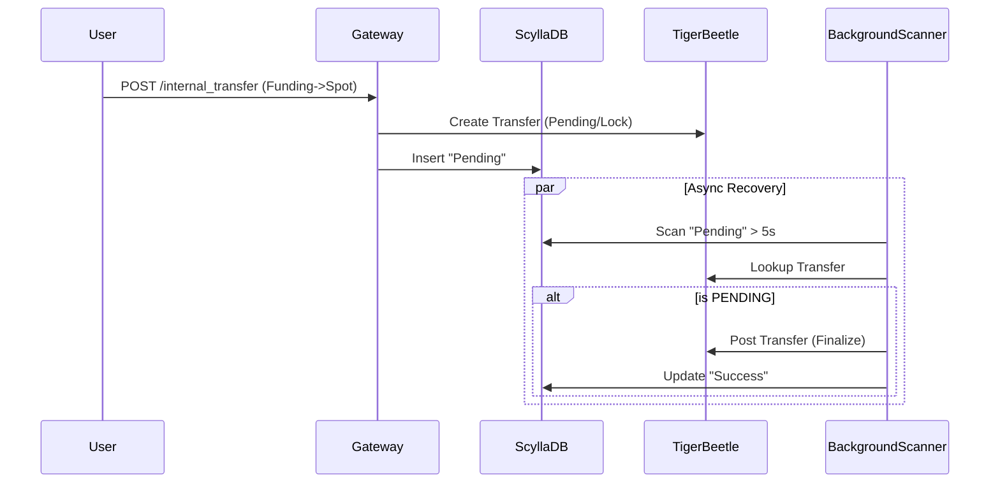

# Internal Transfer Audit Report & Remediation Plan

**Date:** 2025-12-12
**Status:** 🔴 CRITICAL SAFETY ISSUES IDENTIFIED
**Scope:** `handle_internal_transfer` path, Settlement Service, and Recovery Logic

## 1. Executive Summary

A senior engineering code review of the Internal Transfer subsystem identified critical flaws in the implementation. While the functional MVP flow exists, it currently presents significant risks of **funds locking (loss of availability)** and **state inconsistency**. The background recovery mechanism ("Safety Net") is effectively disconnected (dead code) and contains logic errors that misclassify pending transactions as successful.

## 2. Key Findings

### 🔴 Finding A: The "Black Hole" Recovery Service
**Severity:** Critical
**Location:** `src/bin/internal_transfer_settlement.rs`

*   **Issue:** The binary responsible for settlement initializes the `InternalTransferSettlement` struct but **ONLY** runs the Kafka consumer loop (`consumer.run()`).
*   **Gap:** The `run_scanner()` method, which contains the logic to query ScyllaDB for "stuck" transfers and retry them, is **NEVER spawned**.
*   **Impact:** If a transfer fails mid-flight (e.g., after locking funds in TigerBeetle but before updating ScyllaDB), it remains in a transient state indefinitely. The system has no self-healing capability in its current runtime config.

### 🔴 Finding B: Flawed Recovery Logic
**Severity:** Critical
**Location:** `src/api/internal_transfer_settlement.rs` -> `recover_transfer()`

*   **Issue:** The dead code logic checks if a transfer `exists` in TigerBeetle (`!transfers.is_empty()`). If it exists, it marks the DB status as `Success`.
*   **Logical Error:** For **Funding -> Spot** transfers, the system creates a **Pending Transfer** (locks funds).
*   **Impact:** The scanner would see a valid "Pending" entry in TigerBeetle, mistakenly mark the transfer as `Success` in the user DB, while the funds actually remain **Locked/Frozen** in TigerBeetle forever. This results in the user seeing a success message while being unable to use their funds.

### 🟠 Finding C: Missing Saga Finalization (Spot -> Funding)
**Severity:** High
**Location:** `src/api/internal_transfer_handler.rs`

*   **Issue:** The handler creates a TigerBeetle transfer with `Flags::PENDING`.
*   **Gap:** There is no code path (neither in the Handler nor the Settlement service) that executes the "Second Phase" of the transaction: calling `post_transfer` (to finalize) or `void_transfer` (to cancel).
*   **Impact:** Funds are reserved but never moved.

### 🟡 Finding D: Lack of Idempotency
**Severity:** Medium
**Location:** `src/gateway.rs`

*   **Issue:** The API generates a new `request_id` for every incoming HTTP request (`snowflake_gen.generate()`).
*   **Impact:** Network retries from the client side will result in **Double Spending**. The API must accept and enforce a `client_request_id`.

---

## 3. Remediation Plan

To bring this system to a Production-Safe state, the following actions are required immediately.

### Phase 1: Fix the Runtime (Immediate)
1.  **Activate Scanner:** Modify `src/bin/internal_transfer_settlement.rs` to spawn `run_scanner()` in a separate Tokio task alongside the Kafka consumer.

### Phase 2: Fix the Logic (High Priority)
2.  **Correct Recovery Logic:** Refactor `recover_transfer` to inspect TigerBeetle transfer flags:
    *   `PENDING`: Execute `post_transfer` -> Then mark `Success`.
    *   `POSTED`: Mark `Success`.
    *   `VOID`: Mark `Failed`.
3.  **Implement Finalization:** Ensure the active path for Funding -> Spot also executes the `post_transfer` step.

### Phase 3: Harden API (Medium Priority)
4.  **Add Idempotency:** Update API Schema to accept `client_request_id` and check DB for duplicates before processing.

## 4. Architecture Diagram (Corrected)

