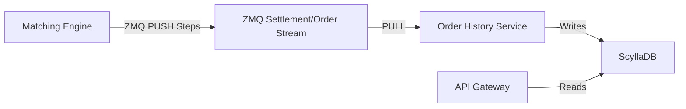

# Order History Service Design

## 1. Overview
The **Order History Service (OHS)** is responsible for maintaining the complete state of all orders (Active and Historic) by consuming the sequential output stream from the Matching Engine. It serves as the query layer for order status, ensuring the Matching Engine remains focused on high-performance matching.

## 2. Design Goals
1.  **Fast Active Order Access**: Low-latency retrieval of open orders (supporting high-frequency polling).
2.  **Efficient History Queries**: Optimized lookups for recent orders (last 100, last 24h) and deep history.
3.  **Strict Consistency**: The Matching Engine's output stream is the **ONLY** source of truth. OHS state must be derived deterministically by replaying this stream.
4.  **Real-Time Updates**: Status changes (New, Partial Fill, Filled, Canceled) must be reflected immediately.

## 3. Architecture

### 3.1. Input Stream (ZMQ)
The Matching Engine emits a unified **`OrderUpdate`** event (analogous to FIX **ExecutionReport**) for all lifecycle changes.
The `status` field determines the State Transition:
-   `status: NEW` -> Transition to **NEW** (Booked).
-   `status: REJECTED` -> Transition to **REJECTED** (Validation Fail).
-   `status: PARTIALLY_FILLED` -> Transition to **PARTIALLY FILLED**.
-   `status: FILLED` -> Transition to **FILLED**.
-   `status: CANCELLED` -> Transition to **CANCELLED** (User).
-   `status: EXPIRED` -> Transition to **EXPIRED** (System).

*   *Note*: Segregating "Events" by type (Accepted/Rejected) is an anti-pattern. A single `OrderUpdate` struct ensures consistent schema for all state changes.

### 3.2. Storage (ScyllaDB)
*   **Table 1 `active_orders`**: Same as above.
*   **Table 2 `order_history_by_user`**:
    *   **Optimization**: Apply `TTL = 7 days` for rows where `final_status = 'REJECTED'` to prevent DB bloat from spam bots. Valid trades kept forever.

### 3.3. Order Lifecycle State Machine
1.  **Accepted (Gateway)**: Validated by Gateway & written to Redpanda Log.
2.  **Processing Outcome** (Mutually Exclusive):
    *   **a. New (Booked)**: Validation Success -> **NEW**.
    *   **b. Rejected**: Validation Failed -> **REJECTED**.
3.  **Partially Filled**: `MatchExec`.
4.  **Filled**: `MatchExec` (Qty met). (Terminal).
5.  **Terminal (Unfilled)**:
    *   **a. Cancelled**: User Action -> **CANCELLED**.
    *   **b. Expired**: System Assurance (IOC/FOK) -> **EXPIRED**.

### 3.4. Pre-Validation Strategy (Gateway)
Since the Gateway cannot guarantee the ME's final balance state (due to async queues), we adopt an **Optimistic Pending Deduction** model:
1.  **Gateway Local Check**: The Gateway maintains a cached "Available Balance" (Scylla Balance - Pending Orders).
2.  **Optimistic Lock**: Upon receiving an API request, the Gateway *immediately* decrements the estimated cost from this local cache **before** writing to Redpanda.
    *   *Benefit*: Prevents users from "double-spending" or flooding the engine with invalid orders.
3.  **Async Reconciliation**:
    *   **Success**: If ME accepts (`OrderAccepted`), the order is booked. The Pending Deduction remains valid until settlement.
    *   **Rejection**: If ME rejects (`OrderRejected`), the Gateway (via OHS/WebSocket) detects the failure and **refunds** the cached pending balance.
4.  **User Experience**: API returns `202 Accepted` (Status: "Pending/Queued"). The UI listens for the definitive `OrderAccepted` or `OrderRejected` event globally.

## 4. Implementation Logic

### 4.1. Event Processing Loop
1.  **Consumes** ZMQ Message.
2.  **Identify Event**:
    -   **`OrderAccepted`**: Insert `active` (Status=NEW). Log correlation `input_offset`.
    -   **`OrderRejected`**: Insert `history` (Status=REJECTED).
    -   **`MatchExecData`**: Update `active` (filled += qty), Insert `fills`. If filled, move to `history`.
    -   **`OrderCancelled`**: Move to `history` (Status=CANCELLED).

### 4.2. Recovery & Replay
-   **Startup**: OHS must track the `output_sequence` processed.
-   **Gap Detection**: If ZMQ gap detected, OHS must halt or request replay (if supported) or rebuild from Snapshot + WAL.
-   **Snapshot**: ME can periodically publish "Active Order Snapshot", allowing OHS to reconcile.

## 5. Critical Considerations
1.  **Idempotency**: All DB writes must be idempotent using `order_id` and `sequence_id` to prevent double-counting fills.
2.  **Versioning**: Order rows should store `last_sequence_id` to prevent out-of-order updates (though ZMQ PUSH guarantees ordering).
3.  **Concurrency**: Sharding processing by `user_id` ensures serial processing for a single user's orders, avoiding race conditions on balance/order state.

## 6. Next Steps
1.  Extend `MatchingEngine` to publish `OrderAccepted` and `OrderCancelled`.
2.  Create `OrderHistoryService` binary consuming ZMQ.
3.  Implement Scylla schemas.
