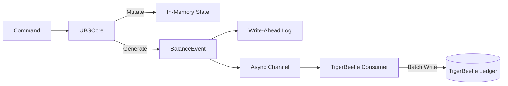

# UBSCore Refactoring & TigerBeetle Integration Design

## Objective
Refactor `UBSCore` to follow a strict **Command -> State Mutation -> Event Generation** pattern. Decouple TigerBeetle integration by consuming generated `BalanceEvents` asynchronously.

## 1. Architecture Overview



## 2. Event Schema (`BalanceEvent`)

We will define a formal `BalanceEvent` enum that represents all state transitions in `UBSCore`.

```rust
pub enum BalanceEvent {
    /// External deposit into the exchange
    Deposited {
        tx_id: u64, // Input Transaction ID
        user_id: u64,
        asset_id: u32,
        amount: u64,
        new_balance: u64,
    },
    /// External withdrawal from the exchange
    Withdrawn {
        tx_id: u64,
        user_id: u64,
        asset_id: u32,
        amount: u64,
        new_balance: u64,
    },
    /// Funds locked for an open order
    FundsLocked {
        order_id: u64,
        user_id: u64,
        asset_id: u32,
        amount: u64, // Total locked (Price + Fee)
        lock_id: u64, // Helper for TB (usually order_id)
    },
    /// Funds unlocked (Order Cancelled/Expired)
    FundsUnlocked {
        order_id: u64,
        user_id: u64,
        asset_id: u32,
        amount: u64,
        reason: UnlockReason, // Cancel, Expire, FillRemainder
    },
    /// Trade Settlement (Atomic Batch)
    TradeSettled {
        match_id: u64,
        buyer_id: u64,
        seller_id: u64,
        base_asset: u32,
        quote_asset: u32,
        base_qty: u64,
        quote_amt: u64,
        buyer_fee: u64,
        seller_fee: u64,
        buyer_order_id: u64,
        seller_order_id: u64,
    },
}
```

## 3. `UBSCore` Refactoring

Currently, `UBSCore` calls `self.tb_sync.queue(...)` directly.
We will refactor this to an **Observer Pattern** or **Channel Injection**.

### Changes:
1.  **Remove `tb_sync` field**: `UBSCore` should not know about TigerBeetle.
2.  **Add `event_tx` field**: `mpsc::UnboundedSender<BalanceEvent>`.
3.  **Method Updates**: `deposit`, `withdraw`, `lock_funds`, etc., will simply construct the `BalanceEvent` and send it to `event_tx` after successfully updating memory state.

```rust
pub struct UBSCore {
    accounts: HashMap<...>,
    event_tx: mpsc::UnboundedSender<BalanceEvent>,
}

impl UBSCore {
    pub fn lock_funds(&mut self, ...) -> Result<()> {
        // 1. Validate Check
        // 2. Mutate Memory (frozen += amt, avail -= amt)
        // 3. Emit Event
        self.event_tx.send(BalanceEvent::FundsLocked { ... });
        Ok(())
    }
}
```

## 4. TigerBeetle Consumer (`TigerBeetleWorker`)

This component listens to the `BalanceEvent` stream and translates it into TigerBeetle transfer batches.

### Workflow:
1.  **Receive**: Read `BalanceEvent` from channel.
2.  **Batching**: Accumulate events for `N` ms or `M` items.
3.  ** Translation**:
    - `Deposited` -> `Transfer(Omnibus -> User)`
    - `FundsLocked` -> `Transfer(User -> Holding)` [Pending]
    - `FundsUnlocked` -> `Transfer(Void Pending)`
    - `TradeSettled` -> `AtomicBatch(Post x2, Swap x2, Fees x2)`
4.  **Write**: Send batch to TigerBeetle Client.
5.  **Fail Fast**: If TB rejects (e.g. `ExceedsCredits`), PANIC. This indicates `UBSCore` logic diverged from `TigerBeetle` rules.

## 5. Benefits
1.  **Testability**: We can test `UBSCore` by just checking the events output, without mocking TB client.
2.  **Pluggability**: We can add other consumers (e.g. Websocket Notifier, SQL Archiver) to the same event stream.
3.  **Clean Architecture**: Separation of concerns.

## 6. Implementation Plan
1.  Define `BalanceEvent` in `src/ubs_core/events.rs`.
2.  Refactor `UBSCore` to use `event_tx`.
3.  Update `TigerBeetleSync` to be the `TigerBeetleWorker` consuming `BalanceEvent`.
4.  Update `main` / `demo` to wire them up.
